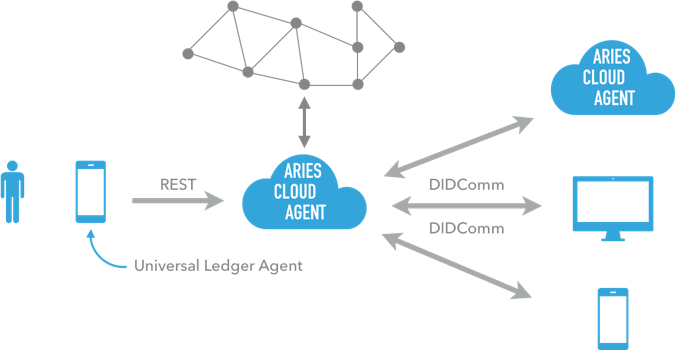

# Hyperledger Aries plugins for the Universal Ledger Agent

By [David Lamers](https://www.linkedin.com/in/lamersdavid/), david.lamers@rabobank.nl - v1.2

_With special thanks to Timo Glastra and Karim Stekelenburg_

**Adoption of SSI is on the horizon, but the challenge is interoperability and usability. Having control over your identity and personal data is one step, but what if issuers and verifiers rely on different standards and infrastructures? Being active for more than 4 years in SSI has taught us a lot. From GDPR challenges, user testing and standards, to partners each having their own solution. That’s why we have designed the [universal ledger agent (ULA)](https://github.com/WebOfTrustInfo/rwot8-barcelona/blob/master/topics-and-advance-readings/universal-ledger-agent.md). With the ULA, a holder and verifier can save and verify data from multiple standards and multiple blockchains. In this paper I explain the basics of the ULA (which is [open source](https://github.com/rabobank-blockchain)) and how Hyperledger Aries was integrated in a plugin for the ULA.**

### The Universal Ledger Agent
The ULA is an interoperability framework for self-sovereign identity. The ULA itself is a more or less a message bus which redirects messages to the right plugins. For each different SSI solution, a plugin can be created. This means that for instance an end-user can save credentials which were issued on Aries as well as verifiable credentials on Ethereum. The same holds for the verifier, who is able to verify credentials issued on multiple platforms. The Blockchain Acceleration Lab at Rabobank has open sourced the following plugins for now for the ULA:

* [universal-ledger-agent](https://github.com/rabobank-blockchain/universal-ledger-agent): The generic, lightweight messaging framework
* [ula-vc-data-management](https://github.com/rabobank-blockchain/ula-vc-data-management#ula-vc-data-management): Storing and retrieving Verifiable Credentials.
* [ula-process-eth-barcode](https://github.com/rabobank-blockchain/ula-process-eth-barcode#ula-process-eth-barcode): Digests an Ethereum QR code payload to kick off the credential exchange process.
* [ula-vp-controller](https://github.com/rabobank-blockchain/ula-vp-controller#ula-vp-controller-plugin): Responds to a challenge request, coming from the ula-process-eth-barcode plugin, to control the entire credential exchange process.
* [crypt-util](https://github.com/rabobank-blockchain/crypt-util#crypt-util): A class for managing cryptographic (derivable) keys.
  *	[LocalCryptUtils](https://github.com/rabobank-blockchain/crypt-util/blob/master/src/local-crypt-utils.ts#L24): An implementation of the interface [CryptUtil](https://github.com/rabobank-blockchain/crypt-util/blob/master/src/interface/crypt-util.ts#L17) The keys and addresses can be used with Ethereum-like blockchains. In this implementation the keys will be stored locally on the device.
* [vp-toolkit](https://github.com/rabobank-blockchain/vp-toolkit#vp-toolkit): A toolkit for managing Verifiable Credentials and Verifiable Presentations
  *	[ChallengeRequestSigner](https://github.com/rabobank-blockchain/vp-toolkit/blob/master/src/service/signers/challenge-request-signer.ts#L21): Signs a [Challenge Request](https://github.com/rabobank-blockchain/vp-toolkit-models/blob/master/src/model/challenge-request.ts#L41)
  *	[VerifiableCredentialGenerator](https://github.com/rabobank-blockchain/vp-toolkit/blob/master/src/service/generators/verifiable-credential-generator.ts#L21): Generates a [Verifiable Credential](https://github.com/rabobank-blockchain/vp-toolkit-models/blob/master/src/model/verifiable-credential.ts#L33)
  *	[VerifiableCredentialSigner](https://github.com/rabobank-blockchain/vp-toolkit/blob/master/src/service/signers/verifiable-credential-signer.ts#L21): Signs a [Verifiable Credential](https://github.com/rabobank-blockchain/vp-toolkit-models/blob/master/src/model/verifiable-credential.ts#L33)
  *	[VerifiablePresentationGenerator](https://github.com/rabobank-blockchain/vp-toolkit/blob/master/src/service/generators/verifiable-presentation-generator.ts#L21): Generates a [Verifiable Presentation](https://github.com/rabobank-blockchain/vp-toolkit-models/blob/master/src/model/verifiable-presentation.ts#L30)
  *	[VerifiablePresentationSigner](https://github.com/rabobank-blockchain/vp-toolkit/blob/master/src/service/signers/verifiable-presentation-signer.ts#L23): Signs a [Verifiable Presentation](https://github.com/rabobank-blockchain/vp-toolkit-models/blob/master/src/model/verifiable-presentation.ts#L30)
* vc-status-registry: interacting with the VCStatusRegistry smart contract on Ethereum which keeps track of DID’s

This means that till now there was only full support for the Ethereum blockchain while the goal of the ULA was interoperability. In the remainder of this paper I will explain how integration with Hyperledger Aries was created.

### Hyperledger Aries support
The ULA as well as Hyperledger Aries both focus on interoperability. Due to the fact that they were designed in nearly the same time period, they exist next to each other. For now, Aries only supports Indy, which is interesting to support in the ULA due to the popularity. Timo Glastra and Karim Stekelenburg did research on Indy support for the ULA (see their [research report](https://github.com/ula-aca/ula-aca-plugins/blob/master/creating-hyperledger-aries-plugins-for-the-universal-ledger-agent-karim-stekelenburg-timo-glastra.pdf)). They had identified the following possibilities to create Indy support in the ULA:

* Indy SDK: the official [Indy SDK](https://github.com/hyperledger/indy-sdk) is widely used, e.g. by Sovrin. However the NodeJS wrapper cannot be used in a browser and the library does not contain logic for credential exchange.
* LibVCX: this library on top of Indy SDK adds a credential exchange protocol. Disadvantage is still that it will only work in NodeJS and no usable implementation of an agent exists
* Hyperledger Aries: Aries is in its early stage but supports Indy. The [javascript framework](https://github.com/hyperledger/aries-framework-javascript) is still in early development and so, not usable at this time (January 2020). However, the [Python cloud agent]( https://github.com/hyperledger/aries-cloudagent-python) is easily to integrate since actions are performed through REST API calls. That is why they decided to create Aries Cloud Agent (ACA) support for the ULA.
 

*Figure 1: Components in the ULA / ACA integration*

### ACA integration design

The ULA and the ACA have one substantial architectural difference. Cloud agents are always available upon request of the end-user or other cloud agents. An agent can, when authorized, push credentials to another agent. The ACA makes also use of external webhooks which are made to a server which should always be online. In the current architecture of the ULA, there is no reachable endpoint to connect to the user. Therefore a webhook relay server was [proposed](https://github.com/ula-aca/ula-aca-plugins/blob/master/creating-hyperledger-aries-plugins-for-the-universal-ledger-agent-karim-stekelenburg-timo-glastra.pdf) which receives and holds all incoming messages from the ACA till the end-user is able to receive them. The webhook relay server can be deployed at the same party as the ACA.
 

*Figure 2: Challenge regarding reachability*

*Figure 3: Proposed solution by Timo Glastra and Karim Stekelenburg*

The following packages were created to support the credentialing proces within the ULA:
* [connection](https://github.com/ula-aca/ula-aca-plugins/blob/master/packages/connection): Creating and maintaining Aries Cloudagent connections with other agents
* [present-proof](https://github.com/ula-aca/ula-aca-plugins/blob/master/packages/present-proof): Creating and receiving Aries Cloudagent Verifiable Presentations
* [schema](https://github.com/ula-aca/ula-aca-plugins/blob/master/packages/schema): Creating and retrieving schemas from the ledger connected to Aries Cloudagent
* [ledger](https://github.com/ula-aca/ula-aca-plugins/blob/master/packages/ledger): Performing ledger actions on the Aries Cloudagent
* [credential-definition](https://github.com/ula-aca/ula-aca-plugins/blob/master/packages/credential-definition): Creating and retrieving credential definitions from the ledger connected to Aries Cloudagent
* [issue-credential](https://github.com/ula-aca/ula-aca-plugins/blob/master/packages/issue-credential): Creating and receiving Aries Cloudagent Verifiable Credentials
* [wallet](https://github.com/ula-aca/ula-aca-plugins/blob/master/packages/wallet): Managing the wallet in Aries Cloudagent
* [credential](https://github.com/ula-aca/ula-aca-plugins/blob/master/packages/credential): Retrieving and removing Aries Cloudagent credentials issued to you
* [webhook-relay-event-router](https://github.com/ula-aca/ula-aca-plugins/blob/master/packages/webhook-relay-event-router): Receiving Aries Cloudagent Webhook Relay webhook events through a WebSocket connection
* [webhook-event-models](https://github.com/ula-aca/ula-aca-plugins/blob/master/packages/webhook-event-models): Helper package with base models for creating plugins that interact with Aries Cloudagent webhook events
* [core](https://github.com/ula-aca/ula-aca-plugins/blob/master/packages/core): Core module of ula-aca that contains code used by all plugins. Base plugin, error handling, etc.

By integrating these packages on the holder as well as verifier side, both should be able to handle credentials from multiple platforms.

### Towards implementation and adoption
The ULA is currently being used in the identity platform we are working on with partners. Within multiple use cases we are validating the need for a SSI based solution and optimizing the customer experience. Current use cases are for example the [career wallet](https://www.youtube.com/watch?v=3XHPEYnFTwc), [income tests for social housing](https://github.com/WebOfTrustInfo/rwot9-prague/blob/master/topics-and-advance-readings/zero-knowledge-proofs-and-vc-in-social-housing.md) and the mortgage application process. Our identity solution is also nominated for the Dutch privacy awards ([more information in Dutch](https://www.privacyfirst.nl/solutions/nederlandse-privacy-awards/item/1167-genomineerden-nederlandse-privacy-awards-2020-bekend.html)).

All projects are currently in pilot phase which means we are testing with a limited scope of users. Our broader vision and why we are working on this topic can be found in an [interview](https://tykn.tech/self-sovereign-identity-rabobank/) I had with Tykn.

##### Disclaimer
We discourage the use of the open sourced work in production environments as it is in active development and not mature enough.